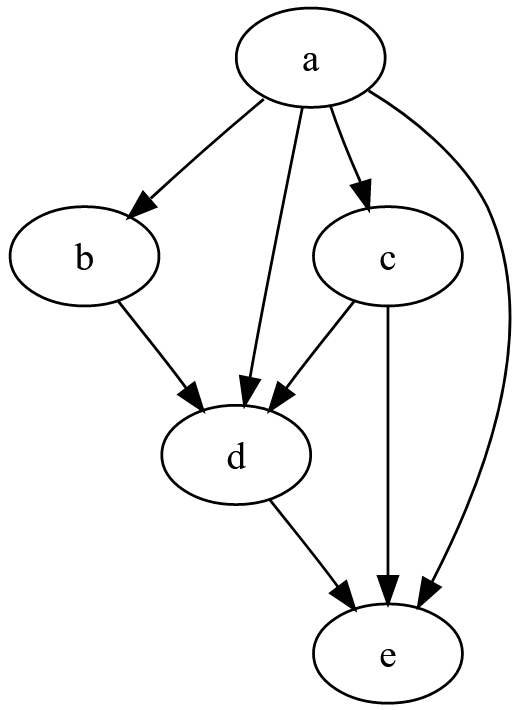
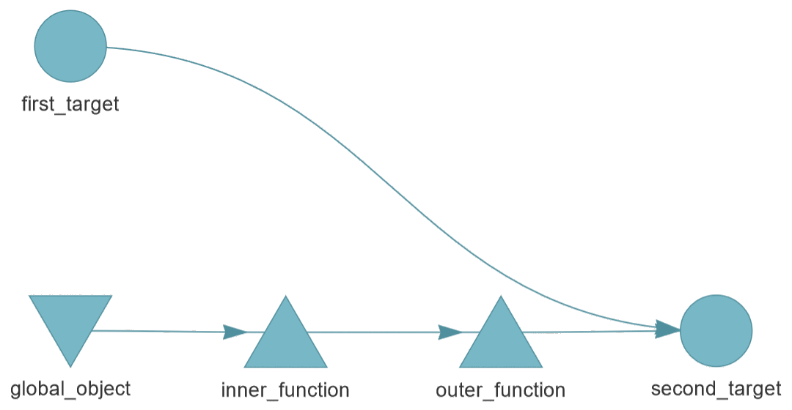

# Examples

## 1. analysis

```
analysis.R
input.dat
```

Simple example, where `analysis.R` uses `input.dat` to produce `output.dat`.

Run example:

```{r}
make("analysis.R", "input.dat", "output.dat")
```

Note how a `make()` call has the general form: script *x* uses *y* to produce
*z*.

## 2. sequential

```
01_model.R
02_plots.R
03_tables.R
data.dat
```

Three scripts, where one runs after the other.

The plot script produces files inside a `plots` folder and the tables script
produces files inside a `tables` folder.

Run example:

```{r}
make("01_model.R", "data.dat", "results.dat")
make("02_plots.R", "results.dat", c("plots/A.png", "plots/B.png"))
make("03_tables.R", "results.dat", c("tables/A.csv", "tables/B.csv"))
```

For convenience, a `_make.R` file is provided, containing these `make()` calls.

## 3. four_minutes

```
data_raw.csv
fit_model.R
get_data.R
plot_model.R
```

Similar to the 'sequential' example above, but based on the
[four-minutes](https://github.com/wlandau/targets-four-minutes) tutorial that
comes with `targets` package.

## 4. dag_wikipedia



```
a.R
b.R
c.R
d.R
e.R
```

DAG example based on the diagram provided in the Wikipedia article on [Directed
acyclic graph](https://en.wikipedia.org/wiki/Directed_acyclic_graph).

Each script produces a corresponding output file: `a.R` produces `out/a.dat`,
`b.R` produces `out/b.dat`, etc.

Run example:

```
make("a.R", prereq=NULL, target="out/a.dat")
make("b.R", prereq="out/a.dat", target="out/b.dat")
make("c.R", prereq="out/a.dat", target="out/c.dat")
make("d.R", prereq=c("out/a.dat", "out/b.dat", "out/c.dat"), target="out/d.dat")
make("e.R", prereq=c("out/a.dat", "out/c.dat", "out/d.dat"), target="out/e.dat")
```

For convenience, a `_make.R` file is provided, containing these `make()` calls.

## 5. dag_targets



```
first_target.R
global_object.R
inner_function.R
outer_function.R
second_target.R
```

DAG example based on the example from the `targets` [user
manual](https://books.ropensci.org/targets/targets.html#dependencies).

The `second_target` depends on `first_target` and `outer_function`, which in
turn depends on `inner_function` and `global_object`.

Run example:

```
make("first_target.R", NULL, "out/first_target.dat")
make("global_object.R", NULL, "out/global_object.dat")
source("inner_function.R")
source("outer_function.R")
make("second_target.R",
     prereq=c("out/first_target.dat", "out/global_object.dat",
              "inner_function.R", "outer_function.R"),
     target="out/second_target.dat")
```

For convenience, a `_make.R` file is provided, containing these `make()` calls.

## Comparison with other make-like packages

The `four_minutes` and `dag_targets` examples provide an interesting comparison
between the `makeit` package and the `targets` package.

- The `makeit` package is script-based, where each step passes the results to
  the next step as output files. The user organizes their workflow by writing
  scripts that produce files. The scripts may include functions, but that is not
  a requirement.

  The `makeit` package relies only on base R and takes a very short time to
  learn, and can be used to run any existing workflows, as long as they are
  based on scripts with input and output files. The package consists of a single
  function that does one thing: Run an R script if underlying files have
  changed, otherwise do nothing.

- The `targets` package is function-based, where each step passes the results to
  the next step as objects in memory. The user organizes their workflow by
  writing functions that produce objects. The functions may produce files, but
  that is not a requirement.

  The `targets` package relies on many underlying packages, takes some time to
  learn, and some work may be required to realign existing workflows into
  functions. The package consists of many useful tools to support workflow
  design and management.

### To summarize

Package   | Paradigm  | State         | Dependencies | Time to learn | Existing workflow      | Features
--------- | --------- | ------------- | ------------ | ------------- | ---------------------- | --------
`makeit`  | Scripts   | Files         | None         | Very short    | Must be file-based     | None
`targets` | Functions | Memory memory | Many         | Some          | Must be function-based | Many
